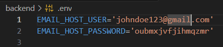

## Table of Contents 
- [Getting Started](#getting-started)
    - [Prerequisites](#prerequisites)
    - [Installation](#installation)
    - [Running the Project](#running-the-project)

### 🔧 Prerequisites
- Python 3.10+

- Node.js 18+

- pip / virtualenv

- Git

---

### 🧩 Installation & Running the Project
Explain the steps required to set up the project locally.  
Include instructions for:
- Cloning the repository  
- Installing backend dependencies
    - Navigate to the backend folder
    - create a **.env** file and put your email details shown in example
    
    - install virtualenv with `pip install virtualenv`
    - activate virtual environment with `virtualenv env`
    - you will see (env) cmd terminal indicating the virtual environment has been activated.
    - install dependencies with `pip install -r requirements.txt`
    - apply migrations with `python manage.py makemigrations`
    - migrate to database with `python manage.py migrate`
    - create superuser/admin with `python manage.py createsuperuser`
    - run the backend server with `python manage.py runserver`
    - the backend server runs at **http://localhost:8000**, verify if its running by going to the 
        admin panel at **http://localhost:8000/admin/**.
- Installing frontend dependencies  
    - Navigate to the **web-fronted** folder.
    - install dependencies with `npm install` 
    - run the frontend server with `npm start`
    - frontend server runs at **http://localhost:3000/**
- Setting up configuration files (like `.env`)  
